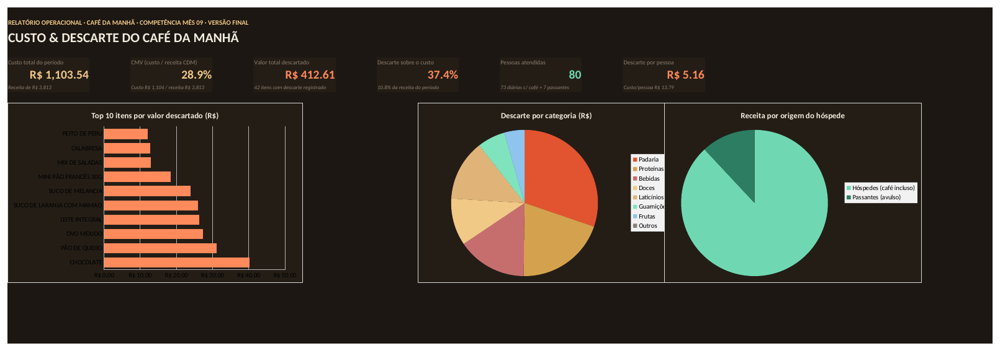
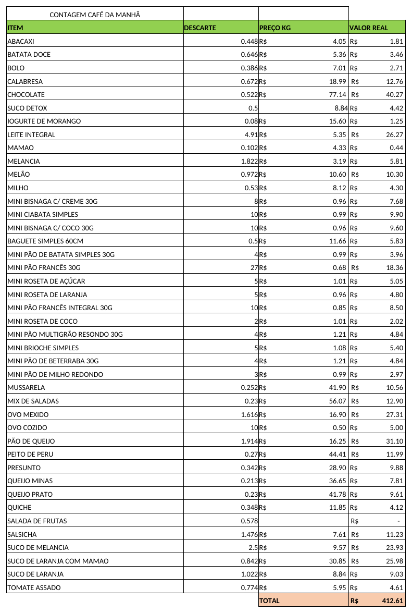
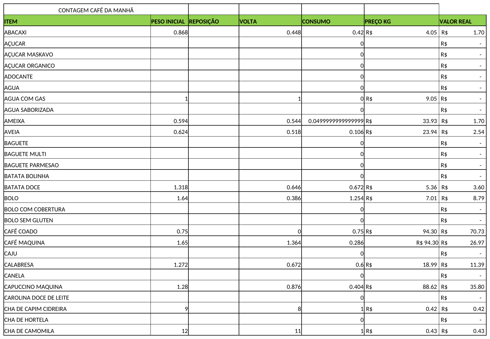
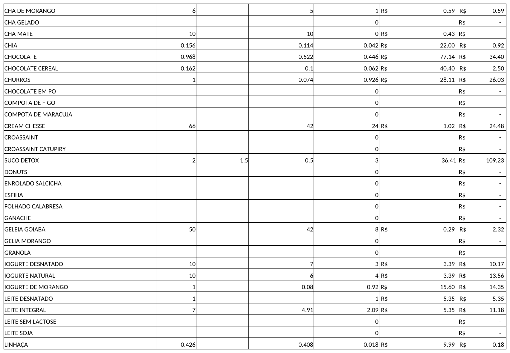
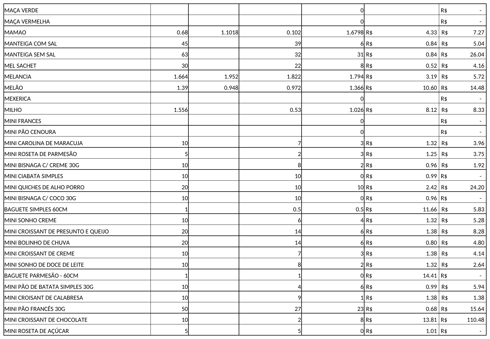
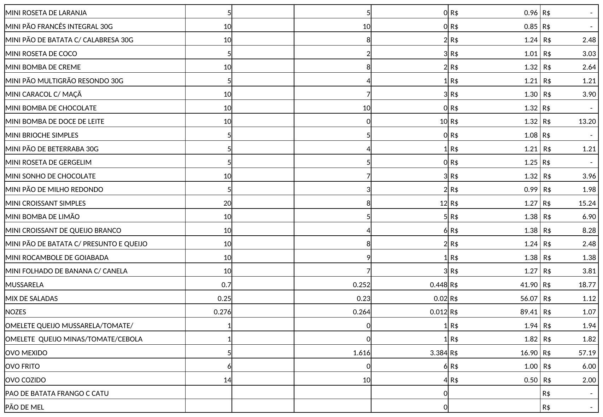
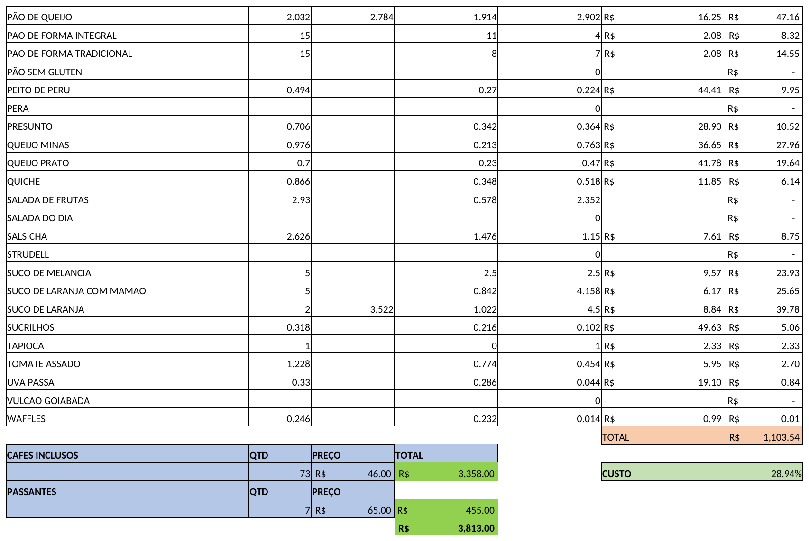

# Dashboard · Custo & Descarte — Café da Manhã

Painel visual com os indicadores de custo, CMV e descarte do café da manhã, gerado a partir da planilha de contagem diária/mensal do operacional.

🔗 **Link publicado:** [https://felipesilvafernandes-droid.github.io/dashboard-cafe-manha/](https://felipesilvafernandes-droid.github.io/dashboard-cafe-manha/)

## O que este painel mostra

- **Custo total do período** e **CMV** (custo ÷ receita de café da manhã)
- **Valor total descartado** e sua participação sobre o custo e sobre a receita
- **Top 10 itens** que mais geraram descarte, em R$
- **Descarte por categoria** (Padaria, Proteínas, Bebidas, Doces, Laticínios, Guarnições, Frutas)
- **Composição do atendimento** (hóspedes com café incluso vs. passantes)
- Demonstrativo completo com todos os itens descartados no período

## Fonte dos dados

O HTML é gerado a partir do arquivo Excel operacional (abas **CUSTO** e **DESCARTE**). Os números são apurados uma vez e "congelados" no HTML — ou seja, este arquivo é uma **foto** do período informado no cabeçalho da página, não um painel conectado ao vivo à planilha.

Para atualizar com dados de um novo período:
1. Gere/atualize a planilha Excel com as abas CUSTO e DESCARTE.
2. Recalcule os indicadores (custo total, descarte por item, CMV, categorias).
3. Substitua o `index.html` deste repositório pela nova versão e suba de novo (**Add file → Upload files → Commit changes**).
4. O GitHub Pages atualiza o link automaticamente em 1–2 minutos, sem precisar reconfigurar nada.

## Imagens


*Aba PAINEL: indicadores de custo, CMV e descarte, e os três gráficos — top 10 itens descartados, descarte por categoria e composição de receita por origem do hóspede.*


*Aba DESCARTE: os 42 itens descartados no período, com quantidade, preço por kg e valor de cada um.*


*Aba CUSTO: lista de itens do cardápio com peso inicial, reposição, volta, consumo, preço/kg e valor (parte 1 de 5).*


*Aba CUSTO: continuação da lista de itens (parte 2 de 5).*


*Aba CUSTO: continuação da lista de itens (parte 3 de 5).*


*Aba CUSTO: continuação da lista de itens (parte 4 de 5).*


*Aba CUSTO: totais do período, CMV e composição de hóspedes/passantes (parte 5 de 5).*

## Estrutura do repositório

```
index.html                                        → o dashboard (arquivo único, sem dependências externas além de fontes/gráficos via CDN)
CUSTO_CDM_MES_09_versao_final_com_dashboard.xlsx  → planilha original (abas CUSTO/DESCARTE intactas) + aba PAINEL com os mesmos gráficos, nativos do Excel
images/                                           → seus prints das abas (nomes e quantidade conforme você definir)
README.md                                         → este arquivo
```

## Como visualizar localmente

- **HTML:** abra o `index.html` em qualquer navegador — não precisa de servidor nem instalação.
- **Excel:** abra o `.xlsx` e vá até a aba **PAINEL** — os KPIs e gráficos ali são fórmulas ligadas às abas CUSTO/DESCARTE, então atualizam sozinhos se os dados de origem mudarem.

## Próximos passos

Esta mesma base de dados (item, categoria, quantidade, preço, valor) está estruturada para alimentar um relatório em **Power BI**, reaproveitando os mesmos agrupamentos usados aqui no HTML.
